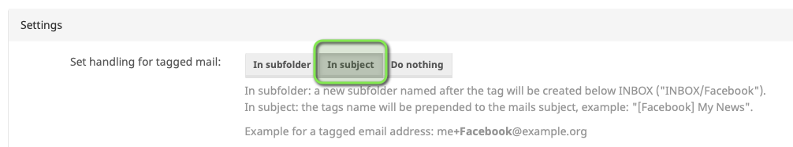

# Mailcow RSFA
RSFA is short for *recipient specific from address*.
It provides a custom modification of (mainly) mailcow's postfix setup to support usage of recipient specific from (or sender) addresses.

## What is this being used for?
To impede credential stuffing attacks (actually your mail users should be smart enough to not use the same password on multiple sites, but who knows...) and to facilitate monitoring of usage or leakage of e-mail addresses when signing up to foreign services, some people consider it being smart to utilize service specific e-mail addresses for account registration.

With a "normal" mailcow installation, this can be typically be achieved by leveraging the plus-extension scheme:

### Plus Extension Addressing
Just use user**\+extension**@domain.tld instead of *user*@domain.tld as your e-mail address and you are all set. Mailcow can be configured how the plus extension should be handled - I prefer rewriting of the subject line by adding a `[extension]` tag over direct delivery to a folder named `extension`.

However, there's a second solution for service specific e-mail addresses: **subdomain addressing**  

### Subdomain Addressing
Subdomain addressing provides an additional subdomain for every configured user. That subdomain is then being configured as catch-all and every incoming e-mail will be delivered to the respective user's mailbox:

Any mail sent to arbitrary-string@**user**.*domain.tld* will be delivered to **user**@*domain.tld*.

### Problem
Both addressing schemes shown above do exactly what we'd expect. However, there's one pitfall:

Whenever you receive an e-mail to such an address and want to reply to it, the response would be sent from your mail account and your actual e-mail address would be used as sender address instead of the recipient/service specific one. 

This could be circumvented by using an MUA that allows rewriting of the respective header lines, but this is cumbersome and not even possible on many MUAs, especially on your mobile devices.

### Solution
Let your mail system do the work for you:

Every incoming mail addressed to either a plus-extension address or a subdomain address will be processed to reflect information on the original *To*-address in the mail's subject line as follows:  

| Original recipient address  | Original Subject  | Subject after processing  |
|---|---|---|
| user+**extension**@domain.tld  | The quick brown fox jumps over the lazy dog | **[extension]** The quick brown fox jumps over the lazy dog  |
| ***extension***@**user**.domain.tld  | The quick brown fox jumps over the lazy dog | \|***extension***@**user**\| The quick brown fox jumps over the lazy dog  |
 
Whenever you reply to such an e-mail (or even write a new mail having respective tags in the subject line), the postfix submission service (well, actually the cleanup service that is triggered from submission) will apply a filter to these messages and

* Remove the tag from the subject line
* Rewrite the header from address accordingly
* Validate sender permissions for subdomain addressing
* Remove already calculated DKIM signatures
* Reinject the message for delivery

Effectively, this will yield the following result:

| Original sender address  | Original Subject  | Subject after processing  | Sender address after processing |
|---|---|---|---|
| user@domain.tld  | **[extension]** The quick brown fox jumps over the lazy dog | The quick brown fox jumps over the lazy dog  | user+**extension**@domain.tld |
| user@domain.tld  | \|***extension***@**user**\| The quick brown fox jumps over the lazy dog | The quick brown fox jumps over the lazy dog  | ***extension***@**user**.domain.tld |

The position of the tag within the subject line doesn't play any role, it might occur anywhere.

---

## Setup
### Download RSFA
Check out this repository to your mailcow:dockerized installation directory (the directory where mailcow.conf can be found) on your docker host.

### Enable Plus Extension
1. Login to mailcow UI as mailbox user
2. Navigate to Mailbox->Settings
3. Define "In Subject" as tagged mail handling routine:
	

### Configure Subdomain Addressing
Just execute the script SDA_setup.sh from the RSFA folder on your docker host.  
This will:  

- retrieve all mailbox names from all domains
- create a new subdomain "mailboxname.domain" for each domain with dots (".") in mailbox names being translated to dashes ("-")  
  E.g.:  
    **Mailboxes:**  
<<<<<<< Updated upstream
    * foo@domain.tld
    * john.doe@domain.tld

    **Created subdomains:**  
    * foo.domain.tld  
    * john-doe.domain.tld
=======
      + joe@domain.tld
      + john.doe@domain.tld

    **Created subdomains:**  
    
      + joe.domain.tld  
      + john-doe.domain.tld
>>>>>>> Stashed changes

- create a catch-all alias for the newly created subdomain, pointing to the respective mailbox  
  E.g.:  
    `@john-doe.domain.tld` -> `john.doe@domain.tld`

- create a sender ACL to allow *mailbox* to send as \*@*subdomain* 
- copy the DKIM configuration of each subdomain to all of its newly created subdomains

Afterwards you still have to add respective MX (and DKIM / SPF) records to your DNS; check the **DNS** settings for each of your subdomains in mailcow UI for advice.  

### Install RSFA
Execute install.sh from the RSFA folder on your docker host.

--- 

# DISCLAIMER
This project had been derived from a manual setup I've applied to my own mail system over time.
You might use it as is, but please be aware that this is far beyond production grade code quality. Use at your own risk!
